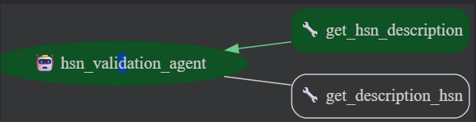

# HSN Code Validation and Suggestion Agent


## Overview

The `hsn_agent` project is an intelligent agent developed using the **ADK - Agent Developer Kit Google Framework** to validate and suggest Harmonized System Nomenclature (HSN) codes based on a master dataset (`HSN_SAC.xlsx - HSN_MSTR.csv`). The agent performs robust validation of HSN codes for format and existence, and provides intelligent suggestions for HSN codes based on user-provided product or service descriptions. It leverages a **Chroma vector database** for efficient storage and querying of HSN data, ensuring scalability and fast performance for large datasets.

This project streamlines HSN code management for trade and commerce applications, offering a modular, extensible architecture that integrates seamlessly with the ADK framework. The agent uses the `gemini-2.0-flash` model for conversational interaction and employs vector-based semantic search for accurate HSN code suggestions.

**GitHub Repository**: [Adhi2624/hsn_agent](https://github.com/Adhi2624/hsn_agent)

## Features

- **HSN Code Validation**:
  - **Format Validation**: Ensures HSN codes are numeric and of valid lengths (2, 4, 6, or 8 digits).
  - **Existence Validation**: Verifies if the input HSN code exists in the Chroma database.
- **HSN Code Suggestion**: Suggests relevant HSN codes based on product or service descriptions using vector-based semantic search in Chroma.
- **Efficient Data Handling**: Preprocesses the master dataset and stores it as vector embeddings in Chroma for optimized querying.
- **Conversational Interface**: Supports interactive queries via a web interface powered by ADK, allowing users to input HSN codes or descriptions.
- **Scalable Architecture**: Uses Chroma’s persistent storage and ADK’s modular components for performance with large datasets.

## Dataset

The project uses the master dataset `HSN_SAC.xlsx - HSN_MSTR.csv`, located in the `data/` directory. The dataset contains:
- **HSNCode**: (Text/String) The HSN code (e.g., `01011010`).
- **Description**: (Text/String) The corresponding goods or service description (e.g., "LIVE HORSES, ASSES, MULES AND HINNIES").

**Source**: [HSN Master Data](https://docs.google.com/spreadsheets/d/1UD4JAAQ6Fgeyc5a1OwBiLV2cPTAK_D2q/edit?usp=sharing&ouid=116706160084886050181&rtpof=true&sd=true)

## Prerequisites

- **Python**: 3.8 or higher
- **ADK Framework**: Installed as per the [ADK Documentation](https://google.github.io/adk-docs/)
- **Chroma Database**: For storing and querying HSN data
- **Google AI Studio API Key**: Required for the `gemini-2.0-flash` model
- **Dependencies** (listed in `requirements.txt`):
  - `pandas`
  - `chromadb`
  - `google-adk`
  - `python-dotenv`

## Installation

1. **Clone the Repository**:
   ```bash
   git clone https://github.com/Adhi2624/hsn_agent.git
   cd hsn_agent
   ```

2. **Set Up a Virtual Environment**:
   ```bash
   python -m venv env
   source env/bin/activate  # On Windows: env\Scripts\activate
   ```

3. **Install Dependencies**:
   ```bash
   pip install -r HSN_agent/requirements.txt
   ```

4. **Set Up Environment Variables**:
   - Create a `.env` file in the `HSN_agent/` directory.
   - Add the following, replacing `your-api-key` with your Google AI Studio API key from [https://aistudio.google.com/prompts/new_chat](https://aistudio.google.com/prompts/new_chat):
     ```
     GOOGLE_GENAI_USE_VERTEXAI=FALSE
     GOOGLE_API_KEY=your-api-key
     ```
5.**Run the chromaDB http server**:
    - Run chromadb http server in port 8001
    ```
    chroma run --port 8001
    ```

5. **Place the Dataset**:
   - Download `HSN_SAC.xlsx - HSN_MSTR.csv` from the provided [link](https://docs.google.com/spreadsheets/d/1UD4JAAQ6Fgeyc5a1OwBiLV2cPTAK_D2q/edit?usp=sharing&ouid=116706160084886050181&rtpof=true&sd=true).
   - Place the file in the `data/` directory.

6. **Preprocess the Dataset**:
   Run the preprocessing script to convert the dataset into vector embeddings and store it in the Chroma database:
   ```bash
   python HSN_agent/preprocess.py
   ```

7. **Run the Agent**:
   Start the ADK web interface:
   ```bash
   adk web
   ```
   Open a browser and navigate to `http://127.0.0.1:8000` to interact with the agent.

## Project Structure

```
hsn_agent/
├── chroma/                          # Chroma database storage
├── chromaClient/
│   └── chromaclient.py             # Chroma database client for data storage/retrieval
├── data/
│   └── HSN_SAC.xlsx - HSN_MSTR.csv # Master HSN dataset
├── HSN_agent/
│   ├── .env                        # Environment variables for Google API key
│   ├── agent.py                    # Core agent logic for validation and suggestion
│   ├── preprocess.py               # Data cleaning and transformation script
│   └── requirements.txt            # Python dependencies
├── screenshots/                    # Output screenshots for validation and suggestion
└── README.md                       # Project documentation
```

## Usage

### 1. Data Preprocessing
Run the preprocessing script to clean the dataset and load it into the Chroma database:
```bash
python HSN_agent/preprocess.py
```
This script reads `HSN_SAC.xlsx - HSN_MSTR.csv`, converts descriptions to vector embeddings, and stores them in Chroma with a batch size of 5145 for efficiency.


### 3. Run the Agent
Start the ADK web interface to interact with the agent:
```bash
adk web
```
Navigate to `http://127.0.0.1:8000` in a browser. The interface allows:
- **Validation**: Enter HSN codes (e.g., `01011010`) to check their validity and retrieve descriptions.
- **Suggestion**: Enter descriptions (e.g., “live horses”) to get relevant HSN codes.


## Agent Architecture

The agent is built using the **ADK Framework** with the following components:
- **Root Agent** (`agent.py`): Defined using the ADK `Agent` class with the `gemini-2.0-flash` model, supporting conversational interaction and tool-based validation/suggestion.
- **Tools**:
  - `get_hsn_description`: Retrieves descriptions for a list of HSN codes, performing format and existence validation.
  - `get_description_hsn`: Suggests HSN codes based on user descriptions using Chroma’s semantic search.
- **Data Handler** (`preprocess.py`): Cleans the dataset and converts descriptions to vector embeddings for Chroma storage.
- **Chroma Client** (`chromaclient.py`): Manages persistent storage and querying of HSN data using Chroma’s default embedding function.
- **Input Handler**: Processes user inputs (HSN codes or descriptions) via the ADK web interface and prompt engineering.
- **Output Formatter**: Returns structured JSON responses with validation results or ranked suggestions.



## Data Handling

- **Preprocessing** (`preprocess.py`): Reads the CSV dataset using `pandas`, extracts `HSNCode` and `Description` columns, and stores them in Chroma as vector embeddings. Data is batched (size 5145) to handle Chroma’s limit of 5146 entries per operation.
- **Chroma Database** (`chromaclient.py`): Uses HTTPclient to make the database as a HTTP server and data is stored persistant in the disk and Loaded in inyo the memory whenever needed. The `Chroma` class establishes a connection on initialization and supports querying by code (`getDatasOnIndex`) or description (`getDatas`).
- **Trade-offs**:
  - **Pre-loading**: Stores the entire dataset in Chroma for fast queries but requires initial setup time and memory.
  - **Persistent Storage**: Ensures data is loaded only once, reducing overhead for subsequent runs.
- **Optimization**: Leverages Chroma’s vector indexing for semantic searches across the description.

## Validation and Suggestion Logic

- **Validation Rules** (`agent.py`):
  - **Format Validation**: Checks if codes are numeric and of lengths 2, 4, 6, or 8 digits using the `validate_code` function. Additional validation is handled via prompt engineering in the ADK agent.
  - **Existence Validation**: Queries Chroma to verify if the code exists in the `HSNCode` column.
- **Suggestion Logic** (`get_description_hsn`): Uses Chroma’s semantic search to match user descriptions to dataset descriptions via vector embeddings, returning relevant HSN codes ranked by similarity.
(`get_hsn_description`): uses the traditional database searches using codes as ID

## Edge Cases Handled

- **Invalid Formats**: Non-numeric codes or incorrect lengths return errors (e.g., “The HSN code 'abc' is invalid”).
- **Empty Inputs**: Handled by `get_hsn_description`, returning an error message (“Please enter some code no code received”).
- **Missing Codes**: Chroma queries return an error if the code is not found (“The HSN code '9999' is not found”).
- **Ambiguous Descriptions**: Semantic search returns top-N matches, or an empty result if no relevant data is found.
- **Large Datasets**: Batch processing (5145 entries) ensures scalability for large datasets.
- **Length validation**: Length of the code is validated(it should be of length 2,4,6,8) using the instruction in the prompt
## Screenshots

Screenshots demonstrating key functionalities are available in the `screenshots/` directory:
- screenshot of webui provided the google adk by default
- Validation output for valid HSN codes (e.g., `01011010`).
- Validation output for invalid HSN codes (e.g., `9999`, non-numeric input).
- Suggestion results for sample descriptions (e.g., “live horses”).
- validation for length (e.g., 010)
- ADK web interface at `http://127.0.0.1:8000`.


## Bonus Features

- **Conversational Interaction**: The ADK agent’s instruction allows conversational queries (e.g., “What’s the HSN code for live horses?”) via the web interface and `gemini-2.0-flash` model.
- **Dynamic Updates**: Chroma’s persistent storage supports incremental updates by re-running `preprocess.py` with modified data, avoiding full redeployment.

